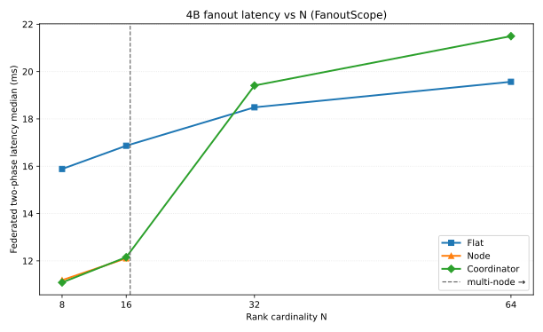

# ④-B 聚合延迟 vs 基数 / FanoutScope · DONE

> 状态：**DONE** · `4B_fanout_latency` · mode=`simulated_network+local_http_calib` · 2026-07-27T06:43:01
> harness：`scripts/fail-slow/param_calib/4b_fanout_latency.py`

## 一句话

延迟-基数曲线：N=8 design=Node@11.19ms (flat=15.88, coord=11.09, peers 7→0)；N=16 design=Node@12.11ms (flat=16.87, coord=12.16, peers 15→0)；N=32 design=Coordinator@19.41ms (flat=18.49, coord=19.41, peers 31→1)；N=64 design=Coordinator@21.50ms (flat=19.57, coord=21.50, peers 63→3)。设计切换 Flat/跨机→Coordinator @ N≥17；延迟交叉 coord<flat @ N=8；跨机以连接数 O(nodes) 为准选 Coordinator，勿因 N≤64 毫秒差退回 Flat。

## 自变量 / 控制

| 项 | 值 |
|---|---|
| 自变量 | N∈[8, 16, 32, 64]；FanoutScope∈['Local', 'Flat', 'Node', 'Coordinator'] |
| 聚合路径 | ④-A 联邦两阶段 SUMMARY→suspect→DETAIL |
| 并发 / 超时 | 128 / 30s |
| 卡/机假设 | 16 |
| CRITERIA | loud θ*=1.16；①-B 1.2/0.4 |
| n_suspects | 1（单 victim） |

## 推荐 FanoutScope 切换点

| 条件 | 推荐 scope |
|---|---|
| N = 1 | **Local** |
| 单机 N ≤ 16 | **Node**（入口 Auto 在 local0 ≡ Coordinator 单机退化） |
| 跨机 N > 16 | **Coordinator**（hierarchical） |
| 显式扁平 | Flat 仅 N≤16 或调试；跨机不推荐 |

- **设计切换** 跨机→Coordinator：**N ≥ 17**
- 延迟交叉 coord_ms<flat_ms：**N = 8**（对照；N≤64 可能 Flat 墙钟略优）
- 规则：设计默认：N=1→Local；单机 N≤16→Node；跨机 N≥17→Coordinator。延迟交叉（coord_ms<flat_ms 的最小 N）仅作对照；N≤64 且并发=128 时 Flat 常仍单波、墙钟可略优，但连接数 O(N) vs Coordinator O(nodes)，跨机/万卡必须 Coordinator。

## 延迟-基数曲线（中位 ms）

| N | Local | Flat | Node | Coordinator | 设计推荐 | 延迟最优 | peers Flat→Coord |
|---:|---:|---:|---:|---:|---|---|---:|
| 8 | (0.65*) | 15.88 | 11.19 | 11.09 | **Node** | Coordinator | 7→0 |
| 16 | (0.65*) | 16.87 | 12.11 | 12.16 | **Node** | Node | 15→0 |
| 32 | (0.65*) | 18.49 | (7.13*) | 19.41 | **Coordinator** | Flat | 31→1 |
| 64 | (0.65*) | 19.57 | (6.66*) | 21.50 | **Coordinator** | Flat | 63→3 |

> `*` = 该 scope 无法完整聚合全部 rank（Local 跨进程 / Node 跨机）。

## 图

## 网络参数（诚实）

- mode=`simulated_network+local_http_calib`
- RTT_intra≈**4.088 ms**；RTT_inter≈**7.359 ms**
- BW_intra=25.0 Gbps；BW_inter=10.0 Gbps
- 本机 HTTP 微基准校准：True（含 Python HTTP 栈，偏高估真 RTT）

## Flat vs Coordinator（连接数）

| N | flat_ms | coord_ms | flat_peers | coord_peers | 省连接 |
|---:|---:|---:|---:|---:|---:|
| 8 | 15.88 | 11.09 | 7 | 0 | 7 |
| 16 | 16.87 | 12.16 | 15 | 0 | 15 |
| 32 | 18.49 | 19.41 | 31 | 1 | 30 |
| 64 | 19.57 | 21.50 | 63 | 3 | 60 |

## 缺口

- 未跑 live 多机 probing-injected cluster query（grj 仅 2×16 空闲壳，无现成 64 卡注入作业；禁碰 yysong-master）
- N=32/64 延迟为 simulated_network（跳数+并发波+straggler），非伪造的 64 卡实测 jsonl
- 本机 HTTP 微基准只校准 loopback 栈/并发，不替代跨 pod RTT

## 支撑设计决策

扇出范围随规模切换：单机 Node、跨机 Coordinator；Flat 连接数 O(N) 在万卡不可扩展。
本曲线在固定 CRITERIA 两阶段与并发128/30s 下给出延迟-基数证据；
未伪造 live 64 卡 probing cluster query。
